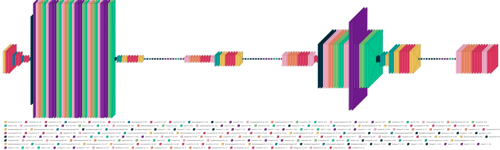

# Dual-Decoder UNet-Transformer Autoencoder for Blind Source Separation

[](https://www.python.org/)
[](https://www.tensorflow.org/)
[](https://colab.research.google.com/)

A TensorFlow/Keras implementation that takes as input a grayscale image formed by averaging an MNIST digit and a Fashion-MNIST item, and separates them back into their original components using a hybrid UNet + Transformer + CBAM architecture with two parallel decoder heads.

---

## 📖 Overview

This project tackles **Blind Source Separation (BSS)** in images:  
- **Input**: single-channel (32×32) image, the pixel-wise average of one MNIST digit and one Fashion-MNIST sample  
- **Output**: two reconstructed images—one of the MNIST digit and one of the Fashion-MNIST item  

Key innovations:
1. **UNet-style encoder** with convolutional downsampling and skip-connections
2. **Transformer bottleneck** (multi-head self-attention) for long-range dependencies
3. **Dual decoders**:
   - Each branch uses upsampling + convolution  
   - Embedded lightweight transformer blocks  
   - Convolutional Block Attention Module (CBAM) for channel & spatial refinement  
   - UNet-style autoencoder sub-blocks to further polish reconstructions  

---

## ⚙️ Model Architecture




```markdown
* **Encoder**: 3× downsampling via Conv2D → ReLU → MaxPool
* **Bottleneck**: 3 transformer encoder blocks (192-dim, 4 heads) with LayerNorm & residuals
* **Decoder branches**:
    * Upsample ×3 (Conv2DTranspose + BatchNorm + ReLU) with skip links
    * **CBAM** attention after each block
    * Intermediate autoencoder sub-structure with a lightweight transformer (64-dim, 2 heads)
* **Output heads**: 1×1 Conv2D with sigmoid activation
```
---
## 📊 Results

- **Best Mean MSE** (averaged over 10 runs, 50 000 samples): **0.00056**  
- Convergence: ~ 60–70 epochs with EarlyStopping (patience=5)  


---

## 🔬 Experimental Insights

- **Baseline UNet + Transformer**: MSE = 0.00056  
- **Transfer learning (EMNIST encoder freezing)**: MSE ≈ 0.0008  
- **Pretrained autoencoder integration**: no improvement beyond MSE = 0.00057  
- **CBAM only**: marginal gain (MSE = 0.0005678)  
- **Dual-decoder with autoencoder sub-blocks**: **best performance**

---

## 🔮 Future Work

- **Imbalanced-class autoencoder**: train an Autoencoder on a dataset with 1 % of one class + 99 % of another to learn and remove rare components  
- **Dynamic freezing schedules** in transformer layers  
- **Multi-scale attention** for finer detail reconstruction  

